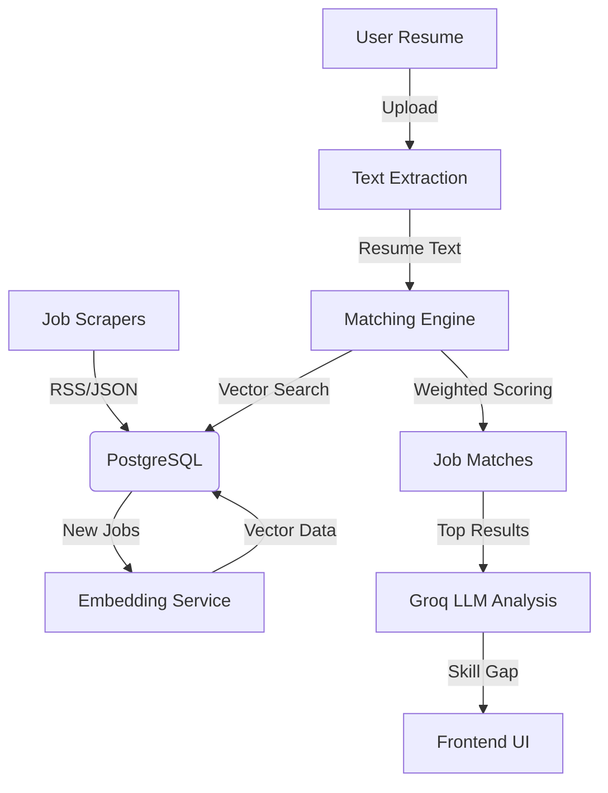

# 🚀 AI Career Guide – Intelligent Job Matching Platform

An advanced, AI-powered career ecosystem that bridges the gap between talent and opportunity. By leveraging vector embeddings and LLM-driven analysis, we provide high-precision job matching, skill gap insights, and automated career assistance.

---

## ✨ Key Features

- **🎯 AI-Powered Vector Matching**: Uses `pgvector` and Sentence Transformer embeddings to calculate semantic similarity between resumes and job descriptions with weighted scoring (Technical Skills, Experience, Projects).
- **🧠 LLM Skill Gap Analysis**: Integrates with **Groq (Llama 3)** to provide deep insights into found and missing skills for every top-tier match.
- **🔄 Real-Time Job Aggregation**: Automated scrapers for global remote job boards like **Remotive.io** and **We Work Remotely**, keeping your feed fresh 24/7.
- **📊 Modern Dashboard**: A premium, responsive interface featuring interactive job cards, real-time notifications, and intuitive search filters.
- **📄 Smart Resume Processing**: Automated text extraction and embedding generation for uploaded resumes to ensure zero-effort matching.
- **⚡ Background Processing**: Leverages **Redis** and background tasks for seamless job synchronization and embedding updates without user latency.

---

## 🛠️ Technology Stack

### Frontend
- **Framework**: [Next.js 16](https://nextjs.org/) (App Router)
- **Styling**: [Tailwind CSS 4](https://tailwindcss.com/)
- **Animations**: [Framer Motion](https://www.framer.com/motion/)
- **Icons**: [Lucide React](https://lucide.dev/)
- **State Management**: [Zustand](https://docs.pmnd.rs/zustand/)

### Backend
- **API Framework**: [FastAPI](https://fastapi.tiangolo.com/) (Python 3.10+)
- **Database**: [PostgreSQL](https://www.postgresql.org/) with [pgvector](https://github.com/pgvector/pgvector)
- **Caching & Rate Limiting**: [Redis](https://redis.io/)
- **AI/ML**: [Hugging Face](https://huggingface.co/) (Embeddings) & [Groq](https://groq.com/) (LLM Analysis)
- **Migrations**: [Alembic](https://alembic.sqlalchemy.org/)

---

## 🏗️ Architecture



---

## 📂 Project Structure

```text
.
├── backend/                # FastAPI application
│   ├── api/                # API routes & controllers
│   ├── core/               # Configuration & settings
│   ├── db/                 # Database connection & models
│   ├── scrapers/           # Job aggregation logic
│   ├── services/           # Business logic (AI matching, embeddings)
│   └── tasks/              # Background worker tasks
├── frontend/               # Next.js application
│   ├── app/                # App Router (Pages: Dashboard, Jobs, Auth)
│   ├── components/         # Reusable UI components (JobCard, Nav, etc.)
│   ├── hooks/              # Custom React hooks
│   └── services/           # Frontend API clients
└── docker-compose.yml      # Orchestration for DB, Redis, API, & Frontend
```

---

## 📱 Core Modules

### 🛠️ The Matching Engine
Our proprietary matching engine uses a hybrid approach:
1.  **Vector Search**: Finds semantically similar jobs based on resume content.
2.  **Weighted Heuristics**: Applies scores for experience years, specific tool matches, and location preferences.
3.  **LLM Refinement**: The top 3 matches undergo a deep-dive analysis by Llama 3 to explain *exactly* why they are a good fit.

### 🎨 User Experience
- **Interactive Dashboard**: Real-time stats and personalized job recommendations.
- **Smart Filters**: Filter by work type (Remote/On-site), experience level, and skills.
- **Glassmorphic UI**: A modern, premium design language with smooth Framer Motion transitions.

---

## 🚀 Getting Started

### 🐳 Option 1: Docker (Recommended)
The fastest way to get the entire ecosystem running.

```bash
docker-compose up --build
```
*Access the frontend at `http://localhost:3000` and API docs at `http://localhost:8000/docs`.*

### 🐍 Option 2: Manual Setup

#### Backend
1. **Navigate to backend**: `cd backend`
2. **Setup Virtual Env**: `python -m venv venv` and `source venv/bin/activate`
3. **Install Deps**: `pip install -r requirements.txt`
4. **Configure ENV**: Create a `.env` file (see `.env.example`)
5. **Run Migrations**: `alembic upgrade head`
6. **Start Server**: `uvicorn main:app --reload`

#### Frontend
1. **Navigate to frontend**: `cd frontend`
2. **Install Deps**: `npm install`
3. **Configure ENV**: Create `.env.local` with `NEXT_PUBLIC_API_URL=http://localhost:8000/api/v1`
4. **Start Development**: `npm run dev`

---

## ⚙️ Environment Variables

Key variables required for full functionality:

| Variable | Description |
|----------|-------------|
| `DATABASE_URL` | PostgreSQL connection string with pgvector support |
| `REDIS_URL` | Redis connection for rate limiting and tasks |
| `HUGGING_FACE_API_TOKEN` | Token for Sentence Transformer embeddings |
| `GROQ_API_KEY` | API key for Llama 3 skill gap analysis |
| `SECRET_KEY` | JWT signing key for authentication |

---

## 🛠️ Troubleshooting

### Docker Issues
If you encounter `failed to connect to the docker API`, ensure that **Docker Desktop** is running. If the issue persists, try restarting the Docker daemon or running the app manually using the instructions below.

### Manual Setup Fallback
If Docker is unavailable, you can start the services independently:
1.  **Database**: Ensure PostgreSQL (with `pgvector`) and Redis are running locally.
2.  **Backend**: `cd backend && uvicorn main:app --reload`
3.  **Frontend**: `cd frontend && npm run dev`

---

## 📄 License
Distributed under the MIT License. See `LICENSE` for more information.
